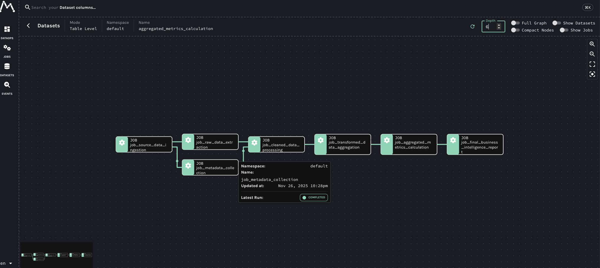
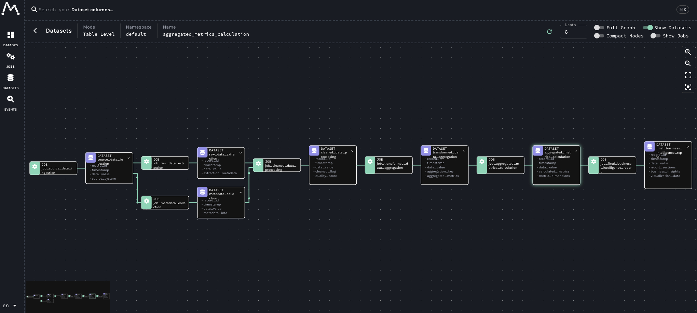

# Marquez 优化版部署与使用指南

本文档介绍如何在 macOS 系统上部署和使用 Marquez 优化版本，包括 Web UI 优化特性、部署配置、数据管理等功能。

## 目录

1. [Web UI 优化亮点](#web-ui-优化亮点)
2. [环境准备](#环境准备)
3. [从源码编译](#从源码编译)
4. [数据库配置](#数据库配置)
5. [配置文件](#配置文件)
6. [启动服务](#启动服务)
7. [验证部署](#验证部署)
8. [测试](#测试)
9. [数据管理](#数据管理)

---

## 1. Web UI 优化亮点





*优化后的 Marquez Web UI 界面，展示了增强的血缘图谱可视化效果和灵活的过滤功能(新增 Show Jobs 和 Show Datasets 过滤)*

相比原始版本，本项目的 Web UI 进行了多项优化和增强，提供更好的用户体验和可视化效果：

| 功能模块 | 原始版本 | 优化版本 | 优化效果 |
|---------|---------|---------|---------|
| **文本显示** | 文本过长时被截断，显示不完整 | 自动换行显示完整内容 | ✅ 完整信息可见，无需猜测 |
| **Jobs 列表** | 名称和命名空间被截断 | 自动换行，完整显示 | ✅ 长名称一目了然 |
| **Datasets 列表** | 名称和命名空间被截断 | 自动换行，完整显示 | ✅ 数据集信息完整展示 |
| **Events 列表** | 作业名称和命名空间被截断 | 自动换行，完整显示 | ✅ 事件信息清晰可读 |
| **血缘图谱节点** | 节点文本固定高度，长文本被截断 | 动态高度，文本自动换行 | ✅ 节点信息完整展示，无需悬停 |
| **节点文本渲染** | SVG text 元素，不支持换行 | 使用 foreignObject，支持 HTML 换行 | ✅ 更好的文本渲染效果 |
| **节点大小计算** | 固定大小，可能浪费空间 | 根据文本内容动态计算 | ✅ 更紧凑的布局，节省空间 |
| **血缘图谱过滤** | 仅支持 Full Graph 和 Compact Nodes | 新增 Show Jobs 和 Show Datasets 开关 | ✅ 灵活控制显示内容，聚焦关注点 |
| **侧边栏导航** | 图标颜色较淡 | 白色加粗图标，更醒目 | ✅ 导航更清晰，视觉层次更好 |
| **工具提示** | 最大宽度限制 600px | 无宽度限制，完整显示 | ✅ 提示信息完整展示 |
| **语言选择器** | 默认样式 | 白色文字，更好的对比度 | ✅ 界面一致性提升 |

### 核心优化特性

#### 🎯 智能文本显示
- **自动换行**：所有列表和节点中的文本支持自动换行，不再截断
- **完整信息**：用户可以看到完整的数据集名称、作业名称等信息
- **响应式布局**：根据内容自动调整显示区域大小

#### 📊 增强的血缘图谱
- **动态节点大小**：根据文本内容自动计算节点高度，避免空间浪费
- **灵活过滤**：支持按 Jobs 和 Datasets 过滤显示，帮助用户聚焦关注的数据流
- **更好的文本渲染**：使用 HTML 渲染节点文本，支持完整的文本格式

#### 🎨 视觉体验提升
- **清晰的导航**：侧边栏图标更醒目，导航更直观
- **一致的样式**：统一的设计语言，提升整体用户体验
- **完整的信息展示**：工具提示和列表项都能完整显示信息

这些优化让 Marquez Web UI 更加易用和强大，特别适合处理复杂的数据血缘关系和大规模的数据集管理。

---

## 2. 环境准备

### 1. 安装 JDK 17

Marquez 0.50.0 要求 JDK 17 或更高版本。

**安装方式：**
```bash
brew install --cask temurin17
```

验证安装：
```bash
java -version
# 应该显示 java version "17.x.x"
```

### 2. 安装 PostgreSQL

**安装方式：**
```bash
brew install postgresql@14
brew services start postgresql@14
```

**注意**：Homebrew 默认安装的本地 PostgreSQL 使用 macOS 当前用户名作为数据库用户，默认没有密码（trust/peer 认证）。初次连接可直接使用 `psql postgres`。

验证安装：
```bash
psql postgres -c "SELECT version();"
```

### 3. 安装 Node.js（用于 Web UI，可选）

Web UI 需要 Node.js 18+。

**安装方式：**
```bash
brew install node@18
```

验证安装：
```bash
node -v
# 应该显示 v18.x.x 或更高版本
```

---

## 3. 从源码编译

### 1. 获取源码

```bash
# 从 Git 克隆
git clone git@github.com:jimmycheng603/marquez-airflow.git
cd marquez-airflow
```

### 2. 编译 JAR

Marquez 使用 Gradle 构建，项目自带 Gradle Wrapper：

```bash
# 首次运行会下载 Gradle Wrapper（需要能访问 Gradle 仓库）
./gradlew tasks

# 编译生成可执行 fat JAR（包含所有依赖）
./gradlew clean shadowJar
```

编译完成后，JAR 文件位于：
- **Fat JAR（推荐，包含所有依赖）**：`api/build/libs/marquez-api-0.50.0.jar`（约 39MB）
  - 注意：由于项目配置，shadowJar 没有 `-all` 后缀，直接生成 `marquez-api-0.50.0.jar`
  - 这是可执行的完整 JAR，包含所有依赖，可以直接运行

**验证是否为 Fat JAR：**

可以通过文件大小判断：
- Fat JAR：约 39MB（包含所有依赖）
- 标准 JAR：通常只有几 MB（仅包含项目代码）

如果只想要标准 JAR（不含依赖），可以运行：
```bash
./gradlew :api:jar
```
但注意：标准 JAR 无法独立运行，需要手动管理所有依赖。


### 3. Web UI 编译

Web UI 使用 Node.js 和 Webpack 构建，需要先安装依赖，然后进行编译：

```bash
cd web

# 安装依赖（首次运行需要）
npm install

# 构建生产版本
npm run build
```

编译完成后，生产版本文件位于 `web/dist/` 目录。

**注意：**
- 需要 Node.js 18+
- 如果 `npm install` 失败，可能需要配置 npm 镜像源：
  ```bash
  npm config set registry https://registry.npmmirror.com
  ```
- 构建完成后，可以使用 `node setupProxy.js` 启动生产版本的 Web UI

**开发模式 vs 生产模式：**
- **开发模式**：使用 `npm run dev`，支持热重载，适合开发调试
- **生产模式**：使用 `npm run build` 构建后，通过 `node setupProxy.js` 启动，性能更优，适合生产环境

---

## 4. 数据库配置

### 1. 创建数据库和用户

使用 PostgreSQL 超级用户连接后执行：

```bash
# 连接到 PostgreSQL（使用当前 macOS 用户名）
psql postgres

# 或指定用户
psql -h localhost -U $(whoami) -d postgres
```

在 psql 中执行：

```sql
CREATE DATABASE marquez;
CREATE USER marquez WITH PASSWORD 'your_password';
GRANT ALL PRIVILEGES ON DATABASE marquez TO marquez;

-- 切换到 marquez 数据库
\c marquez

-- 授予 schema 权限
GRANT ALL ON SCHEMA public TO marquez;

-- 退出
\q
```

### 2. 初始化数据库 Schema

Marquez 使用 Flyway 进行数据库迁移管理，有两种方式初始化数据库 Schema：

**方式 1：自动迁移（推荐）**

配置好 `marquez.dev.yml` 后，Marquez 会在启动时自动执行 Flyway 迁移。

**方式 2：手动执行 SQL**

1. 从 [Marquez Releases](https://github.com/MarquezProject/marquez/releases) 下载对应版本的 `marquez-<version>-sql.zip`
2. 解压后按顺序执行迁移脚本：

```bash
unzip marquez-*.zip
psql -h localhost -U marquez -d marquez -f db/migrate/V1__init.sql
psql -h localhost -U marquez -d marquez -f db/migrate/V2__*.sql
# 依次执行到最新版本
```

---

## 5. 配置文件

Marquez 使用 YAML 格式的配置文件来管理服务配置。项目提供了 `marquez.dev.yml` 作为开发环境的配置文件模板。

### 1. 配置文件位置

配置文件位于项目根目录：
- **开发环境配置**：`marquez.dev.yml`
- **生产环境配置**：可复制 `marquez.dev.yml` 并重命名为 `marquez.yml`

### 2. 配置文件结构

编辑 `marquez.dev.yml` 配置文件：

```yaml
# marquez.dev.yml

# HTTP 服务器配置
server:
  applicationConnectors:
  - type: http
    port: ${MARQUEZ_PORT:-3000}  # API 端口，可通过环境变量覆盖
    httpCompliance: RFC7230_LEGACY
  adminConnectors:
  - type: http
    port: ${MARQUEZ_ADMIN_PORT:-3001}  # Admin 端口，可通过环境变量覆盖

# 数据库配置
db:
  driverClass: org.postgresql.Driver
  url: jdbc:postgresql://${POSTGRES_HOST:-localhost}:${POSTGRES_PORT:-5432}/marquez
  user: ${POSTGRES_USER:-marquez}
  password: ${POSTGRES_PASSWORD:-1qaz@WSX}

# 数据库迁移配置
migrateOnStartup: true  # 启动时自动执行数据库迁移

# GraphQL 配置
graphql:
  enabled: true  # 启用 GraphQL 端点

# 日志配置
logging:
  level: INFO  # 日志级别：TRACE, DEBUG, INFO, WARN, ERROR, FATAL
  appenders:
    - type: console

# OpenSearch 搜索功能配置（可选）
search:
  enabled: ${SEARCH_ENABLED:-false}  # 默认禁用，本地开发通常不需要
  scheme: http
  host: ${SEARCH_HOST:-localhost}
  port: ${SEARCH_PORT:-9200}
  username: ${SEARCH_USERNAME:-admin}
  password: ${SEARCH_PASSWORD:-admin}

# 自定义标签
tags:
  - name: PII
    description: Personally identifiable information
  - name: SENSITIVE
    description: Contains sensitive information
```

### 3. 配置说明

#### 3.1 端口配置

- **API 端口**：默认 3000，可通过 `MARQUEZ_PORT` 环境变量覆盖
- **Admin 端口**：默认 3001，可通过 `MARQUEZ_ADMIN_PORT` 环境变量覆盖

#### 3.2 数据库配置

- **连接 URL**：`jdbc:postgresql://host:port/database`
- **用户名和密码**：可通过环境变量 `POSTGRES_USER` 和 `POSTGRES_PASSWORD` 覆盖
- **数据库名**：默认为 `marquez`

#### 3.3 环境变量覆盖

配置文件支持通过环境变量覆盖配置项，格式为：`${ENV_VAR:-default_value}`

常用环境变量：
- `MARQUEZ_PORT`：API 端口
- `MARQUEZ_ADMIN_PORT`：Admin 端口
- `POSTGRES_HOST`：数据库主机地址
- `POSTGRES_PORT`：数据库端口
- `POSTGRES_USER`：数据库用户名
- `POSTGRES_PASSWORD`：数据库密码
- `SEARCH_ENABLED`：是否启用搜索功能

### 4. 配置文件示例

**开发环境配置**（`marquez.dev.yml`）：
- 端口：3000/3001（与管理脚本一致）
- 搜索功能：默认禁用
- 日志级别：INFO

**生产环境配置**（`marquez.yml`）：
- 端口：可通过环境变量配置为 5000/5001（避免与 macOS 系统端口冲突）
- 搜索功能：根据需要启用
- 日志级别：可根据需要调整

**注意**：`marquez.dev.yml` 默认端口为 3000/3001，与管理脚本一致。如需使用其他端口，可通过环境变量覆盖：
```bash
export MARQUEZ_PORT=5000
export MARQUEZ_ADMIN_PORT=5001
```

### 5. 配置验证

启动服务前，建议验证配置文件格式：

```bash
# 检查 YAML 语法（需要安装 yamllint）
yamllint marquez.dev.yml

# 或使用 Python 验证
python3 -c "import yaml; yaml.safe_load(open('marquez.dev.yml'))"
```

---

## 6. 启动服务

### 1. 启动 Marquez API

**方法 1：使用管理脚本（推荐）**

管理脚本默认使用端口 3000（API）和 3001（Admin）：

```bash
# 启动 API 服务
./bin/marquez_manager.sh start

# 查看服务状态
./bin/marquez_manager.sh status

# 查看日志
./bin/marquez_manager.sh logs
```

**方法 2：手动启动**

使用配置文件中的端口（默认 5000/5001）：

```bash
# 使用编译好的 JAR 文件启动
java -jar api/build/libs/marquez-api-0.50.0.jar server marquez.dev.yml

# 或使用环境变量覆盖端口
export MARQUEZ_PORT=5000
export MARQUEZ_ADMIN_PORT=5001
java -jar api/build/libs/marquez-api-0.50.0.jar server marquez.dev.yml
```

**端口说明：**
- 管理脚本默认端口：API 3000, Admin 3001, Web 8080
- 配置文件默认端口：API 5000, Admin 5001
- 测试脚本使用端口：3000（与管理脚本一致）

启动成功后，日志中会显示 "Jersey application started"，可通过以下地址验证：

```bash
# 如果使用管理脚本启动（端口 3000）
curl http://localhost:3000/api/v1/health
curl http://localhost:3000/api/v1/version

# 如果使用配置文件启动（端口 5000）
curl http://localhost:5000/api/v1/health
curl http://localhost:5000/api/v1/version
```

### 2. 启动 Web UI（可选）

**方法 1：开发模式（推荐）**

```bash
cd web

# 安装依赖（首次运行需要）
npm install

# 设置环境变量
export MARQUEZ_HOST=localhost
export MARQUEZ_PORT=5000

# 启动开发服务器（会自动打开浏览器）
npm run dev
```

开发服务器默认在 `http://localhost:8080` 启动。

**方法 2：快速启动（一行命令）**

```bash
cd web && MARQUEZ_HOST=localhost MARQUEZ_PORT=5000 npm run dev
```

**方法 3：生产模式**

```bash
cd web

# 安装依赖
npm install

# 构建生产版本
npm run build

# 启动 Web UI
export MARQUEZ_HOST=localhost
export MARQUEZ_PORT=5000
export WEB_PORT=3002
node setupProxy.js
```

**访问地址：** `http://localhost:8080` 或 `http://localhost:3002`

**注意：**
- 确保 API 服务在 `http://localhost:5000` 运行
- 需要 Node.js 18+
- 如果 `npm install` 失败，可能需要配置 npm 镜像源

### 3. 管理服务

使用管理脚本可以方便地管理服务：

```bash
# 启动服务
./bin/marquez_manager.sh start

# 停止服务
./bin/marquez_manager.sh stop

# 重启服务
./bin/marquez_manager.sh restart

# 查看状态
./bin/marquez_manager.sh status

# 查看日志
./bin/marquez_manager.sh logs

# 查看帮助
./bin/marquez_manager.sh help
```

---

## 7. 验证部署

### 1. 检查数据库表

```bash
# 连接到数据库
psql -h localhost -U marquez -d marquez

# 查看所有表
\dt

# 查看表结构示例
\d jobs
\d runs
\d datasets

# 查看 Flyway 迁移历史
SELECT * FROM flyway_schema_history ORDER BY installed_rank DESC LIMIT 10;

# 退出
\q
```

### 2. 检查 Marquez API

根据启动方式选择对应的端口：

```bash
# 如果使用管理脚本启动（端口 3000）
curl http://localhost:3000/api/v1/health
curl http://localhost:3000/api/v1/namespaces
curl http://localhost:3000/api/v1/version

# 如果使用配置文件启动（端口 5000）
curl http://localhost:5000/api/v1/health
curl http://localhost:5000/api/v1/namespaces
curl http://localhost:5000/api/v1/version
```

### 3. 检查 Marquez Web UI

访问 Marquez Web UI：
- 开发模式：`http://localhost:8080`
- 生产模式：`http://localhost:3002`

应该能看到 Marquez 界面。

---

## 8. 测试

### 1. 测试 Lineage 数据写入

使用 `add_marquez_data.py` 脚本测试向 Marquez 写入复杂的6层 Lineage 数据：

```bash
# 确保 Marquez API 服务正在运行（使用管理脚本启动，端口 3000）
./bin/marquez_manager.sh status

# 运行测试脚本（脚本默认使用端口 3000）
python3 bin/add_marquez_data.py
```

**注意**：测试脚本默认连接到 `http://localhost:3000/api/v1`，如果使用其他端口启动服务，需要修改脚本中的 `MARQUEZ_API_URL` 变量。

该脚本会创建以下复杂的6层数据血缘关系：
- **创建测试命名空间**：default
- **创建13个数据集**：从数据源到最终业务报告，所有名称均≥10个字符
- **创建13个作业**：对应每个数据处理阶段
- **建立6层深度血缘关系**：
  - **层级1**：数据源采集 (`source_data_ingestion`)
  - **层级2**：数据提取 (`raw_data_extraction`) 和元数据收集 (`metadata_collection`)
  - **层级3**：数据清洗 (`cleaned_data_processing`) 和数据转换 (`validated_data_transformation`)
  - **层级4**：数据聚合 (`transformed_data_aggregation`)、数据验证 (`enriched_data_validation`) 和质量检查 (`quality_checked_data`)
  - **层级5**：指标计算 (`aggregated_metrics_calculation`)、指标导出 (`validated_metrics_export`, `enriched_metrics_export`)
  - **层级6**：最终业务报告 (`final_business_intelligence_report`)

**6层血缘关系图**：
```
source_data_ingestion (L1)
  ├──> raw_data_extraction (L2)
  │      ├──> cleaned_data_processing (L3)
  │      │      ├──> transformed_data_aggregation (L4)
  │      │      │      ├──> aggregated_metrics_calculation (L5)
  │      │      │      │      └──> final_business_intelligence_report (L6)
  │      │      │      └──> validated_metrics_export (L5)
  │      │      │             └──> final_business_intelligence_report (L6)
  │      │      └──> enriched_data_validation (L4)
  │      │             └──> enriched_metrics_export (L5)
  │      │                    └──> final_business_intelligence_report (L6)
  │      └──> validated_data_transformation (L3)
  │             └──> quality_checked_data (L4)
  │                    └──> enriched_data_validation (L4) [合并点]
  └──> metadata_collection (L2)
         └──> cleaned_data_processing (L3) [合并点]
```

**特点**：
- ✅ **6层深度**：展示复杂的数据处理流程
- ✅ **多路径合并**：最终报告依赖3个不同的指标数据集
- ✅ **长名称测试**：所有数据集和作业名称≥10个字符，测试文本自动换行功能
- ✅ **完整 Schema**：每个数据集都包含详细的字段定义

**在 Web UI 中查看**：
- 访问 `http://localhost:8080`
- 导航到 `default` 命名空间
- 查看 `final_business_intelligence_report` 数据集的完整血缘关系
- 使用 **Show Jobs** 和 **Show Datasets** 开关灵活控制显示内容
- 体验优化后的文本自动换行和动态节点大小功能

### 2. 查看 Lineage 数据

创建完数据血缘后，可以通过以下方式查看：

**方法 1：通过 API 查询**

```bash
# 查询命名空间列表
curl http://localhost:3000/api/v1/namespaces

# 查询作业列表
curl http://localhost:3000/api/v1/jobs?namespace=default

# 查询数据集列表
curl http://localhost:3000/api/v1/datasets?namespace=default

# 查询特定数据集的 Lineage
curl http://localhost:3000/api/v1/lineage?nodeId=dataset:default:dataset_f
```

**方法 2：在 Web UI 中查看**

访问 Web UI 并导航到相应的命名空间和数据集查看 Lineage 图谱。

### 3. 在 Web UI 中查看

1. 访问 Web UI：
   - 开发模式：`http://localhost:8080`
   - 生产模式：`http://localhost:3002`
   - 管理脚本启动：`http://localhost:8080`
2. 导航到相应的命名空间
3. 查看作业和数据集
4. 查看 Lineage 图谱

**注意**：Web UI 需要连接到正确的 API 端口。如果使用管理脚本启动（端口 3000），需要设置：
```bash
export MARQUEZ_HOST=localhost
export MARQUEZ_PORT=3000
```

---

## 9. 数据管理

项目提供了 `delete_marquez_data.sh` 脚本用于删除 Marquez 中的数据，支持删除 dataset、job、namespace 和 run。

### 1. 脚本功能

脚本支持以下删除类型：

- **dataset**：删除数据集（通过 API，软删除）
- **job**：删除作业（通过 API，软删除）
- **namespace**：删除命名空间（通过 API，软删除，会删除该 namespace 下的所有 datasets 和 jobs）
- **run**：删除运行记录（通过数据库，硬删除）
- **all**：删除 namespace 下的所有数据（通过数据库，包括 namespace 本身）

### 2. 基本用法

```bash
# 查看帮助信息
./bin/delete_marquez_data.sh --help
```

### 3. 删除示例

#### 3.1 删除 Dataset（通过 API）

```bash
# 删除指定命名空间下的数据集
./bin/delete_marquez_data.sh --type dataset --namespace my-namespace --name my-dataset

# 指定 API URL
./bin/delete_marquez_data.sh --type dataset --namespace my-namespace --name my-dataset --api-url http://localhost:3000/api/v1
```

**注意**：Dataset 的删除是"软删除"，如果新的 OpenLineage 事件包含该 dataset，它会被恢复。

#### 3.2 删除 Job（通过 API）

```bash
# 删除指定命名空间下的作业
./bin/delete_marquez_data.sh --type job --namespace my-namespace --name my-job
```

**注意**：Job 的删除是"软删除"，如果新的 OpenLineage 事件包含该 job，它会被恢复。

#### 3.3 删除 Namespace（通过 API）

```bash
# 删除命名空间（会同时删除该 namespace 下的所有 datasets 和 jobs）
./bin/delete_marquez_data.sh --type namespace --namespace my-namespace
```

**注意**：
- Namespace 的删除是"软删除"，会同时删除该 namespace 下的所有 datasets 和 jobs
- 如果新的 OpenLineage 事件包含该 namespace，它会被恢复

#### 3.4 删除 Run（通过数据库）

```bash
# 删除指定作业的运行记录
./bin/delete_marquez_data.sh --type run --db --namespace my-namespace --job my-job --run-id <uuid>

# 指定数据库连接信息
./bin/delete_marquez_data.sh --type run --db \
  --namespace my-namespace \
  --job my-job \
  --run-id <uuid> \
  --db-host localhost \
  --db-port 5432 \
  --db-name marquez \
  --db-user marquez \
  --db-password your_password
```

**注意**：Run 的删除是"硬删除"，会从数据库中永久删除，无法恢复。

#### 3.5 删除 Namespace 下的所有数据（通过数据库）

```bash
# 删除 namespace 下的所有数据（包括 datasets、jobs、runs 和 namespace 本身）
./bin/delete_marquez_data.sh --type all --db --namespace my-namespace

# 指定数据库连接信息
./bin/delete_marquez_data.sh --type all --db \
  --namespace my-namespace \
  --db-host localhost \
  --db-port 5432 \
  --db-name marquez \
  --db-user marquez \
  --db-password your_password
```

**注意**：
- 这会删除该 namespace 下的所有 datasets、jobs、runs 和 namespace 本身
- Namespace 会被软删除（设置 `is_hidden=true`），从下拉框中移除
- 执行前会要求确认，输入 `yes` 才会继续

#### 3.6 预览删除操作（Dry Run）

```bash
# 预览删除操作，不实际执行
./bin/delete_marquez_data.sh --type all --db --namespace my-namespace --dry-run
```

### 4. 环境变量配置

脚本支持通过环境变量配置默认值：

```bash
# 设置 API URL
export MARQUEZ_API_URL=http://localhost:3000/api/v1

# 设置数据库连接信息
export POSTGRES_HOST=localhost
export POSTGRES_PORT=5432
export POSTGRES_DB=marquez
export POSTGRES_USER=marquez
export POSTGRES_PASSWORD=your_password

# 然后运行脚本（无需指定这些参数）
./bin/delete_marquez_data.sh --type dataset --namespace my-namespace --name my-dataset
```

### 5. 删除类型说明

| 删除类型 | 删除方式 | 删除性质 | 说明 |
|---------|---------|---------|------|
| **dataset** | API | 软删除 | 可通过新的 OpenLineage 事件恢复 |
| **job** | API | 软删除 | 可通过新的 OpenLineage 事件恢复 |
| **namespace** | API | 软删除 | 会删除该 namespace 下的所有 datasets 和 jobs，可通过新的 OpenLineage 事件恢复 |
| **run** | 数据库 | 硬删除 | 永久删除，无法恢复 |
| **all** | 数据库 | 硬删除 + 软删除 | 删除所有数据，namespace 软删除（从下拉框移除） |

### 6. 注意事项

1. **软删除 vs 硬删除**：
   - 软删除：通过 API 删除 dataset、job、namespace，设置 `is_hidden=true`，可通过新的 OpenLineage 事件恢复
   - 硬删除：通过数据库直接删除 run，永久删除，无法恢复

2. **删除 namespace 的影响**：
   - 删除 namespace 会同时删除该 namespace 下的所有 datasets 和 jobs
   - 使用 `--type all --db` 删除时，会删除所有数据并删除 namespace 本身（从下拉框中移除）

3. **数据库删除权限**：
   - 使用 `--db` 选项时，需要数据库用户有足够的权限执行 DELETE 操作

4. **安全提示**：
   - 删除操作不可逆（特别是硬删除），建议先使用 `--dry-run` 预览
   - 删除 namespace 下的所有数据会要求确认，输入 `yes` 才会继续

